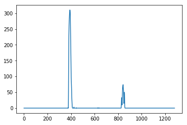

### Advanced Lane Finding Project

#### The goals / steps of this project are the following:

Compute the camera calibration matrix and distortion coefficients given a set of chessboard images.
* Apply a distortion correction to raw images.
* Use color transforms, gradients, etc., to create a thresholded binary image.
* Apply a perspective transform to rectify binary image ("birds-eye view").
* Detect lane pixels and fit to find the lane boundary.
* Determine the curvature of the lane and vehicle position with respect to center.
* Warp the detected lane boundaries back onto the original image.
* Output visual display of the lane boundaries and numerical estimation of lane curvature and vehicle position.

### Rubric Points
Here I will consider the rubric points individually and describe how I addressed each point in my implementation.

### Camera Calibration

**1. Briefly state how you computed the camera matrix and distortion coefficients. Provide an example of a distortion corrected calibration image.**

The code for this step is contained in the first code cell of the IPython notebook located in "P4.ipynb" - Step 1.

I start by preparing "object points", which will be the (x, y, z) coordinates of the chessboard corners in the world. Here I am assuming the chessboard is fixed on the (x, y) plane at z=0, such that the object points are the same for each calibration image. Thus, objp is just a replicated array of coordinates, and objpoints will be appended with a copy of it every time I successfully detect all chessboard corners in a test image. imgpoints will be appended with the (x, y) pixel position of each of the corners in the image plane with each successful chessboard detection.

I then used the output objpoints and imgpoints to compute the camera calibration and distortion coefficients using the cv2.calibrateCamera() function. I applied this distortion correction to the test image using the cv2.undistort() function and obtained this result:


### Pipelines 

**1. Provide an example of a distortion-corrected image.**

I used cv2.undistort to undistort the images. This function needs mtx and dis values which are calucated in previous step. Step 2 of 'P4.ipynb' is the code for this.


**2. Describe how (and identify where in your code) you used color transforms, gradients or other methods to create a thresholded binary image. Provide an example of a binary image result.**

I used a combination of gradient thresholds and color thresholds to generate a binary image (thresholding steps are available in Step 3 of 'P4.'). Here's an example of my output for this step. 


**3. Describe how (and identify where in your code) you performed a perspective transform and provide an example of a transformed image.**

The code for my perspective transform includes a function called perspective_transform(), which appears in Step 5. of 'P4.ipynd'. The perspective_transform() function takes as inputs an image (img) as well matrix M, which is calculated through source and destination poitns. I chose the hardcode the source and destination points in the following manner:


```python
#Source points
x1,y1 = 562,470
x2,y2 = 243,686
x3,y3 = 1063,686
x4,y4 = 721,470

#destination points 
a1,b1 = 378,255
a2,b2 = 378,677
a3,b3 = 853,677
a4,b4 = 853,255
```


**4. Describe how to check where accross the image, pixels are of lanes?**

I plotted a histogram and np.argmax gives the position of both lanes. Code for this is written after step 6 in 'P4.ipynb'



**4. Describe how (and identify where in your code) you identified lane-line pixels and fit their positions with a polynomial?**

I have implemented sliding window approach in the Step 7 of 'P4.ipynb'. This detects the lane pixles by stacking windows above and calculating non zero pixels. 

When I have sufficient number of frames, There is a function to look at average of old frames. I prefer to use sliding window as it is giving better result. Code of this is implemented in Step 8 of 'P4.ipynb'. 

I used np.polyfit to calculate coeffiecnts and then Ay^2 + by + C to generate the curve.

Below are the visual result of sliding window and lane_line_in_margin. 


**5. Describe how (and identify where in your code) you calculated the radius of curvature of the lane and the position of the vehicle with respect to center.**

I calculated radius of curvature in Step 9 of 'P4.ipynb'. I used the given details to convert from pixels to meters. I used this formula curverad_x = ((1 + (2*fit_cr_x[0]*y_eval*ym_per_pix + fit_cr_x[1])**2)**1.5) / np.absolute(2*fit_cr_x[0]) and then averaged the result.


**6. Provide an example image of your result plotted back down onto the road such that the lane area is identified clearly.**

I implemented this step 11 of 'P4.ipynd' in the function pipeline(). Here is an example of my result on a test image:


### Visulatisation on other test images


### Pipeline (video)
1. I have provided my video in file name project_video_output.mp4 in home directory


### Discussion
1. Briefly discuss any problems / issues you faced in your implementation of this project. Where will your pipeline likely fail? What could you do to make it more robust?

Problems that I faced.
1. As I am using multiple thresholding hyper parameters, I took a while to get to the correct values of combination. I spent a lot of time tuning them.
2. The lines are getting jittery at places, I have done some averaging but it need to be improved.
3. I faced probelms when shadows and dark pathces are present on the road.
    
Pipeline if likely to fail under following events - 
1. Lane line gets very faded and dark (low saturation)
2. There is a very steap curve with significant change in directions. 
3. Multiple lane likes figure on road.
